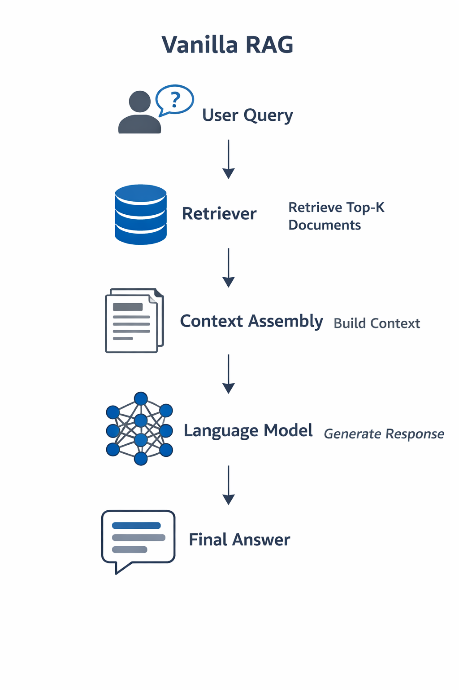

# Vanilla RAG

## Definition

Vanilla RAG is the minimal retrieve-then-generate inference pattern. A user query triggers a single retrieval step, which surfaces documents from an external collection. Those documents are assembled into a context and passed to a language model, which generates a response in a single pass. There is no feedback, no iteration, and no opportunity for the system to revise its retrieval or generation based on intermediate results.

This pattern represents the simplest possible integration of retrieval and generation. Every more complex RAG design can be understood as an extension or modification of this baseline.

## Core idea

Vanilla RAG connects retrieval and generation in the most direct way. The system retrieves once, constructs a context once, and generates once. The process is linear and unidirectional.

The key insight is that vanilla RAG changes how the model is used, not how it is trained. The model's parameters remain fixed. What changes is the input: instead of receiving only a query, the model receives a query along with retrieved evidence. This allows the model to condition its output on information it could not have learned during training, without any modification to the model itself.

The simplicity of this design is intentional. Vanilla RAG does not attempt to solve every problem that arises when combining retrieval with generation. It establishes the minimal structure needed to demonstrate that retrieval can improve generation, and nothing more.

## The vanilla RAG pipeline

The vanilla RAG pipeline consists of four sequential steps:

1. A user submits a query expressing an information need.
2. A retrieval component searches an external document collection and returns a ranked list of passages estimated to be relevant to the query.
3. A context construction step selects, orders, and potentially truncates the retrieved passages to fit within the model's context window, then combines them with the original query into a single input.
4. A language model generates a response conditioned on the constructed context.

Each step runs exactly once. There is no loop, no branching, and no feedback from later steps to earlier ones.

## What vanilla RAG assumes

Vanilla RAG makes several implicit assumptions that determine when it succeeds and when it fails.

It assumes that retrieval works. The system expects that the retrieval step will surface documents containing the information needed to answer the query. If retrieval fails, the generation stage has no way to recover.

It assumes that context construction is sufficient. The system expects that the relevant information, once retrieved, can be fit into the context window and arranged in a way that the model can use. If the context is poorly constructed, truncated, or cluttered with irrelevant material, generation quality suffers.

It assumes that the model will use the retrieved content. The system expects that the model will ground its response in the provided evidence rather than relying solely on its parametric knowledge. If the model ignores or misinterprets the retrieved passages, the output may be unsupported or incorrect.

It assumes that one retrieval pass is enough. The system does not allow for follow-up queries, clarification requests, or iterative refinement. Whatever is retrieved on the first attempt is all the system has to work with.

## What vanilla RAG does well

Vanilla RAG is simple. The pipeline is easy to understand, implement, and debug. Each component has a clear role, and the flow of information is transparent.

Vanilla RAG is modular. The retrieval and generation components can be developed, evaluated, and replaced independently. Improvements to retrieval benefit the system without changes to generation, and vice versa.

Vanilla RAG is a practical starting point. For many applications, the retrieve-then-generate pattern produces useful results without the complexity of more advanced designs. It establishes a working baseline that can be extended as requirements become clearer.

Vanilla RAG demonstrates a core principle. Even in its simplest form, combining retrieval with generation improves factual grounding compared to generation from parametric knowledge alone. This observation motivates the entire field of retrieval-augmented generation.

## What vanilla RAG does not address

Vanilla RAG does not verify retrieval quality. There is no mechanism to detect when retrieval has failed or returned irrelevant documents.

Vanilla RAG does not handle ambiguity. If the query is unclear or the retrieved documents are contradictory, the system has no way to seek clarification or reconcile conflicting evidence.

Vanilla RAG does not enforce grounding. The model is not constrained to use the retrieved content faithfully. It may ignore evidence, blend it with parametric knowledge, or generate unsupported claims.

Vanilla RAG does not support iteration. The system cannot refine its retrieval based on generation progress, issue follow-up queries, or revisit earlier decisions.

Vanilla RAG does not include verification. There is no step to check whether the generated response is consistent with the retrieved evidence or factually correct.

These are not failures of implementation. They are structural characteristics of the vanilla pattern. Addressing them requires moving beyond the minimal retrieve-then-generate design.

## Why vanilla RAG is a useful baseline

Vanilla RAG is the reference point against which all other RAG designs are measured. Understanding its structure makes it possible to identify what more advanced approaches add and why those additions are necessary.

Every extension to RAG, whether it introduces re-ranking, query rewriting, iterative retrieval, or verification, can be understood as a response to a limitation of the vanilla pattern. Without a clear picture of vanilla RAG, these extensions appear as arbitrary complexity rather than targeted solutions.

Vanilla RAG also provides a practical baseline for evaluation. When assessing a new retrieval method, generation model, or pipeline design, comparing against vanilla RAG reveals whether the added complexity produces meaningful improvement.

Finally, vanilla RAG is often good enough. For many applications, the simple retrieve-then-generate pattern meets requirements without the overhead of more sophisticated designs. Recognizing when vanilla RAG is sufficient, and when its limitations become unacceptable, is an essential skill for system design.

The limitations of vanilla RAG become clearer when examining the failure modes that arise in practice, which is the focus of the next concept.
