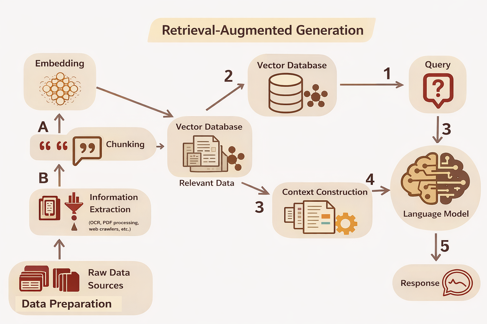

# What Is RAG

## Definition

Retrieval-Augmented Generation is a system design pattern that combines information retrieval with language model generation at inference time. Rather than relying solely on knowledge encoded in model parameters, a RAG system retrieves relevant documents from an external collection and provides them to the language model as part of its input. The model then generates a response conditioned on both the original query and the retrieved context.

RAG is not a single algorithm or model architecture. It is a way of structuring inference so that generation is grounded in external information. The retrieval and generation components can be implemented in many ways, but the core pattern remains the same: retrieve first, then generate.

## Core idea

The central idea of RAG is the separation of knowledge access from language generation.

Language models are capable of producing fluent, coherent text, but the knowledge they can draw on is limited to what was encoded during training. RAG addresses this limitation by introducing a retrieval step that supplies external information at the moment of generation. The model does not need to have memorized the relevant facts; it only needs to be able to use them when they appear in its input.

This separation has important consequences. The document collection can be updated independently of the model. New information can be added, outdated information can be removed, and domain-specific content can be included without retraining. The model's role shifts from being the sole source of knowledge to being a reasoning and synthesis engine that operates over retrieved evidence.

RAG does not change how the model was trained. It changes how the model is used at inference time. The parameters remain fixed; only the input changes.

## Why RAG exists

RAG exists because standalone language models have fundamental limitations that cannot be overcome through scale alone.

Training data is static. A model trained on data collected up to a certain point has no knowledge of events, publications, or changes that occurred afterward. For applications that require current information, this limitation is disqualifying.

Knowledge coverage is uneven. Models are exposed to whatever appears in their training corpora, which may underrepresent specialized domains, proprietary information, or content in less common languages. Even very large models cannot reliably answer questions about topics that were poorly represented during training.

Inference cannot update parameters. When a user provides new information in a query, the model can use that information to shape its response, but it cannot incorporate it into its long-term knowledge. Each inference is independent, and nothing persists across requests.

Retrieval addresses these limitations by providing a mechanism to inject external, up-to-date, and domain-specific information into the model's input. The model does not need to know everything; it needs access to relevant information at the right time.

## How RAG differs from training

RAG operates entirely at inference time. It does not modify the model's parameters and does not teach the model new facts in any persistent sense.

Training and fine-tuning adjust the model's internal representations based on data. These processes are computationally expensive, require access to the model's internals, and produce changes that persist across all future inferences. Once trained, the model's knowledge is fixed until the next training run.

RAG takes a different approach. Instead of embedding knowledge into parameters, it provides knowledge through the input. The model's capabilities remain unchanged; only the information available in the context varies. This makes RAG more flexible for knowledge that changes frequently, more scalable for large document collections, and more practical for organizations that cannot retrain models.

The tradeoff is that RAG depends on the quality of retrieval and the structure of the input. The model can only use information that is retrieved and presented effectively. RAG does not make the model smarter; it gives the model more to work with.

## What RAG is not

RAG is not a model architecture. It does not specify how the language model or the retriever should be implemented. Any retrieval method and any generative model can be combined into a RAG system.

RAG is not a database. The retrieval component searches a document collection, but RAG as a pattern does not dictate how that collection is stored, indexed, or queried. The details of storage and indexing are implementation concerns, not part of the RAG abstraction itself.

RAG is not a guarantee of correctness. Retrieving documents does not ensure that the model will use them appropriately, that the retrieved documents are accurate, or that the generated response will be faithful to the evidence. RAG systems can still produce incorrect, misleading, or unsupported outputs. The quality of the retrieval, the construction of the context, and the behavior of the model all influence the reliability of the final response.

## When RAG is appropriate

RAG is well suited for knowledge-intensive tasks where the information needed to answer a question is unlikely to be reliably encoded in model parameters. This includes questions about recent events, specialized domains, proprietary data, or large corpora that exceed what a model can memorize.

RAG is also appropriate when information changes frequently. Because the document collection can be updated without retraining, RAG systems can remain current in ways that static models cannot.

RAG is useful when grounding is required. In settings where it is important to trace a response back to a source document, RAG provides a natural structure for attribution. The retrieved passages are explicit inputs to generation, making it possible to identify what evidence the model had access to.

RAG is less appropriate when the task does not require external knowledge, when retrieval quality cannot be ensured, or when the added complexity of a retrieval pipeline is not justified by the benefits.

## Limitations

RAG inherits the limitations of its components. If retrieval fails to surface relevant documents, the model cannot use them. If the context window is too small to include all relevant information, some evidence will be excluded. If the prompt does not effectively frame the retrieved content, the model may ignore or misinterpret it.

RAG does not eliminate hallucinations. A model can still generate plausible-sounding text that is not supported by the retrieved evidence. Retrieval provides information; it does not constrain the model to use that information faithfully.

Pipeline complexity is another consideration. RAG systems involve multiple components that must work together: retrieval, ranking, context construction, and generation. Each component introduces potential failure modes, and diagnosing problems requires understanding how information flows through the system.

Finally, RAG does not improve reasoning. If the model lacks the ability to synthesize, compare, or evaluate information, providing more evidence will not compensate for that limitation. RAG supplies information; the model must still process it correctly.

## Relationship to upcoming concepts

Understanding RAG requires understanding the components and constraints that shape its behavior. Retrieval determines what information is available. Inference pipelines determine how retrieval, ranking, and generation are orchestrated. Context windows determine how much information can be presented to the model at once. Prompting determines how that information is framed. The distinction between fine-tuning and RAG clarifies when each approach is appropriate.

These concepts are not isolated. They interact to determine the behavior of a RAG system as a whole. A complete understanding of RAG requires examining each of these dimensions and how they relate to one another.
