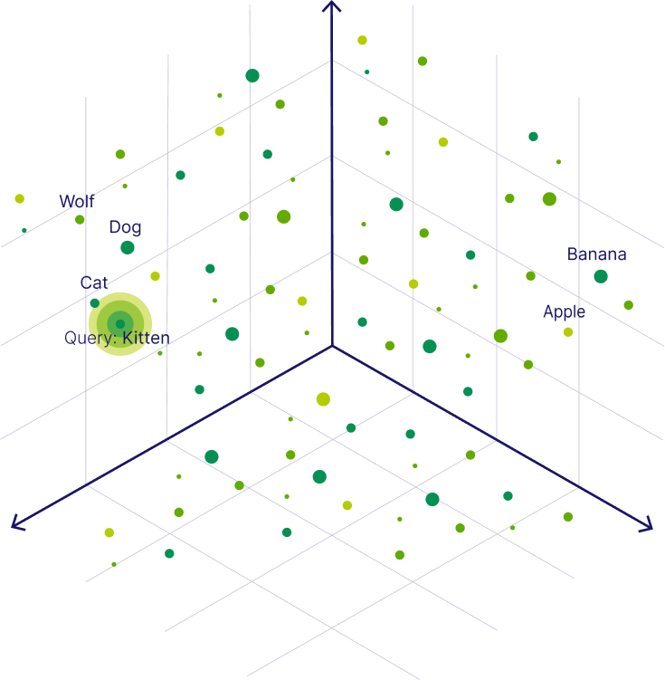

# Dense Retrieval

## Definition

Dense retrieval is a retrieval paradigm in which queries and documents are represented in a shared continuous space, and relevance is estimated based on semantic similarity rather than exact word overlap.

## Core idea

Dense retrieval represents queries and documents as points in the same numeric space and treats closeness in that space as a signal of relevance. This allows retrieval to be based on meaning rather than exact word matches, making it possible to find relevant documents even when the wording differs.

## Why this concept matters for RAG

Dense retrieval plays a central role in modern Retrieval Augmented Generation (RAG) systems because it determines how a language model finds external information to use when generating an answer. In many RAG settings, the words used in a query differ from the words used in documents that contain the relevant information.

Methods that rely on exact or near exact word matching often fail in these cases because they cannot connect different ways of expressing the same idea. Dense retrieval addresses this problem by allowing documents to be retrieved based on meaning rather than shared vocabulary.

By focusing on meaning instead of word overlap, dense retrieval makes it more likely that relevant information is found during the retrieval step. This increases the chance that the generation model receives useful context when producing an answer.

At the same time, dense retrieval is not always the best choice. Its effectiveness depends on how well the learned representations capture the target domain, and there are situations where simple word based matching remains highly effective.

## Historical context

Dense retrieval developed at the intersection of neural information retrieval and open-domain question answering. Early neural approaches were mainly used to re-rank documents that had already been retrieved using traditional keyword based methods. During most of the 2010s, large scale retrieval was still dominated by inverted index techniques such as BM25.

In the late 2010s, advances in representation learning and scalable similarity search made it practical to use dense representations for retrieving directly from large document collections. Experiments during this period showed that dense retrievers could perform as well as, or better than, strong keyword based baselines on common question answering benchmarks. These results established dense retrieval as a realistic alternative to term based retrieval and paved the way for its use as the retrieval component in RAG systems.

## Canonical papers

- **Dense Passage Retrieval for Open-Domain Question Answering**
  EMNLP, 2020
  [https://aclanthology.org/2020.emnlp-main.550/](https://aclanthology.org/2020.emnlp-main.550/)
  This paper established dense retrieval as a practical first stage retrieval method for open domain question answering, demonstrating that learned semantic representations could outperform strong lexical baselines at scale.

- **Latent Retrieval for Weakly Supervised Open Domain Question Answering**
  ACL, 2019
  [https://aclanthology.org/P19-1612/](https://aclanthology.org/P19-1612/)
  This work treated retrieval as a latent process within question answering, helping to shift the field away from explicit keyword matching and toward learned semantic retrieval.

- **REALM: Retrieval-Augmented Language Model Pre-Training**
  ICML, 2020
  [https://proceedings.mlr.press/v119/guu20a.html](https://proceedings.mlr.press/v119/guu20a.html)
  This paper showed how dense retrieval could be tightly integrated with language model training, linking retrieval directly to generation and influencing later Retrieval Augmented Generation systems.

## Common misconceptions

A common misconception is that dense retrieval reliably returns semantically relevant results. In practice, retrieval quality depends on the learned representations, which may miss fine grained distinctions or reflect biases present in the training data. Another frequent misunderstanding is the belief that high similarity in the representation space implies factual correctness. Dense retrieval surfaces passages that are close to a query in meaning, but this closeness does not guarantee that the retrieved content is accurate or reliable.

It is also often assumed that dense retrieval fully replaces lexical retrieval. In reality, word based methods continue to perform well in situations that require exact matching, such as queries involving specific entities, numbers, or rare terms, particularly when the retrieval model has limited exposure to the target domain.

## Limitations

Dense retrieval relies heavily on the quality and coverage of the representations it learns from data. When the retrieval model is used in domains or for types of queries that differ from those it was trained on, performance can drop noticeably. This problem, often referred to as domain shift, arises because the learned representations may no longer reflect the meanings that matter in the new setting.

Dense representations are also difficult to interpret. Unlike word based retrieval methods, where it is clear which terms contributed to a match, dense retrieval provides little insight into why a particular passage was retrieved. This lack of transparency can make errors harder to diagnose and correct.

Dense retrieval can also perform poorly on queries that depend on exact surface level matches, such as specific names, numbers, or rare terms. Because meaning is represented in a continuous space, fine grained lexical details may be blurred or lost. Finally, the effectiveness of dense retrieval is limited by the amount and diversity of training data available, which means that uncommon or highly specialized concepts may not be well represented.

Together, these limitations help explain why dense retrieval is rarely used in isolation. They have motivated continued reliance on lexical retrieval, as well as the development of hybrid retrieval approaches that combine semantic and exact matching signals, and greater attention to how retrieval is integrated into inference pipelines within generation augmented systems.